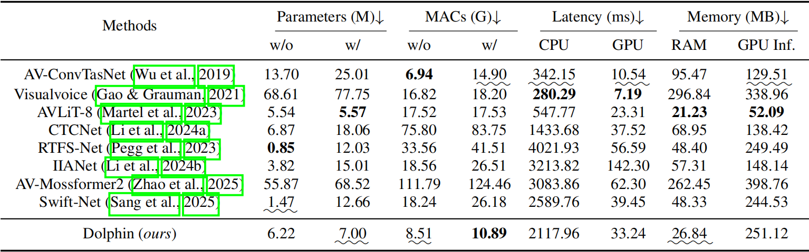

<p align="center">
  
</p>
<h3 align="center">Dolphin: Efficient Audio-Visual Speech Separation with Discrete Lip Semantics and Hierarchical Top-Down Attention</h3>
<p align="center">
  <strong>Kai Li*, Kejun Gao*, Xiaolin Hu </strong><br>
  <strong>Tsinghua University</strong><br>
  <a href="#">📜 Paper</a> | <a href="#">🎵 Demo</a> | <a href="#">💻 Code</a>
</p>

<p align="center">
  
  
  
</p>

<p align="center">

> Dolphin is an efficient audio-visual speech separation framework that leverages discrete lip semantics and hierarchical attention mechanisms to achieve state-of-the-art performance with significantly reduced computational complexity.

## 🎯 Highlights

- **50%+ Parameter Reduction**: Achieves superior performance with less than half the parameters of SOTA methods
- **6× Faster Inference**: Dramatically accelerates GPU inference speed for real-world deployment
- **Discrete Lip Semantics**: Maps continuous lip movements into phoneme-aligned discrete units
- **Heat-Conv Innovation**: Novel convolution module inspired by heat equation for efficient multi-scale modeling

## 💥 News

- **[2025-09-16]** Code and pre-trained models will be released! 📦
- **[2025-09-10]** Demo website coming soon! 🎵

## 📜 Abstract

We propose an efficient audio-visual speech separation framework called Dolphin, addressing the issues of existing methods being “strong in time-domain performance but computationally expensive, and visual encoders being excessively large and redundant.” On the visual side, we adopt a dual-path 3D vector quantization (DP3D‑VQ) encoder to decouple linguistic/non-linguistic information from lip movements and map continuous motion into discrete units that are highly aligned with phonemes. On the audio side, we design a lightweight codec, introducing top-down attention and Heat‑Conv inspired by the heat equation to model multi-scale dependencies at extremely low cost. On three public datasets, Dolphin surpasses the SOTA IIANet, while achieving >50% parameter reduction, >2.4× decrease in MACs, and >6× GPU inference speedup, demonstrating practical deployability.

## 🏗️ Architecture


> The overall architecture of Dolphin.

### Video Encoder


> The video encoder of Dolphin.

### Dolphin Model Overview


> The overall architecture of Dolphin's separator.

### Key Components


1. **Heat-Conv Blocks**
   - Inspired by the heat equation from physics
   - Captures multi-scale dependencies efficiently
   - Replaces computation-intensive traditional convolutions

2. **Hierarchical Top-Down Attention**
   - Strengthens focus on target speech
   - Enables effective cross-modal alignment
   - Maintains lightweight computation

## 📊 Results

### Performance Comparison

Performance metrics on three public AVSS benchmark datasets. Bold indicates best performance.


### Efficiency Analysis



Dolphin achieves:
- ✅ **>50%** parameter reduction
- ✅ **2.4×** lower computational cost (MACs)
- ✅ **6×** faster GPU inference speed
- ✅ Superior separation quality across all metrics

## 📦 Installation

```bash
git clone https://github.com/JusperLee/Dolphin.git
cd Dolphin
pip install torch torchvision
pip install -r requirements.txt
```

### Requirements

- Python >= 3.10
- PyTorch >= 2.5.0
- CUDA >= 12.4
- Other dependencies in requirements.txt

## 🚀 Quick Start

### Inference with Pre-trained Model

```python
# Single audio-visual separation
python inference.py \
    --input /path/to/video.mp4 \
    --output /path/to/output/directory \
    --speakers 2 \
    --detect-every-n 8 \
    --face-scale 1.5 \
    --cuda-device 0 \
    --config checkpoints/vox2/conf.yml
```

## 📁 Model Zoo

| Model | Training Data | SI-SNRi | PESQ | Download |
|-------|--------------|---------|------|----------|
| Dolphin | VoxCeleb2 | 16.1 dB | 3.45 | [Link](https://huggingface.co/JusperLee/Dolphin) |

## 📖 Citation

If you find Dolphin useful in your research, please cite:

```bibtex
@article{anonymous2025Dolphin,
  title={Dolphin: Efficient Audio-Visual Speech Separation with Discrete Lip Semantics and Hierarchical Top-Down Attention},
  author={Anonymous},
  journal={Under Review},
  year={2025}
}
```

## 🤝 Acknowledgments

We thank the authors of [IIANet](https://github.com/JusperLee/IIANet) and [SepReformer](https://github.com/dmlguq456/SepReformer) for providing parts of the code used in this project.

## 📧 Contact

For questions and feedback, please open an issue on GitHub or contact us at: [tsinghua.kaili@gmail.com](tsinghua.kaili@gmail.com)

## 📄 License

This project is licensed under the MIT License - see the [LICENSE](LICENSE) file for details.

<p align="center">
  Made with stars ⭐️ for efficient audio-visual speech separation
</p>