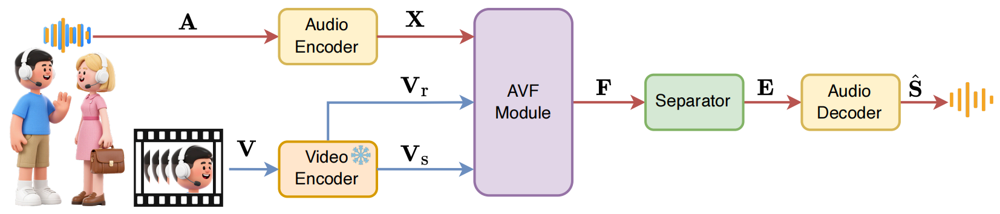
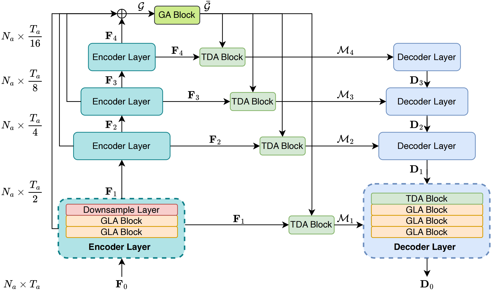

<p align="center">
  
</p>
<h3 align="center">Dolphin: Efficient Audio-Visual Speech Separation with Discrete Lip Semantics and Multi-Scale Global-Local Attention</h3>
<p align="center">
  <strong>Kai Li*, Kejun Gao*, Xiaolin Hu </strong><br>
  <strong>Tsinghua University</strong>
</p>

<p align="center">
  
  
  
  <a href="https://arxiv.org/" target="_blank" rel="noreferrer noopener">
    
  </a>
  <a href="https://huggingface.co/JusperLee/Dolphin" target="_blank" rel="noreferrer noopener">
    
  </a>
  <a href="https://dolphin.cslikai.cn/" target="_blank" rel="noreferrer noopener">
    
  </a>
</p>

<p align="center">

> Dolphin is an efficient audio-visual speech separation framework that leverages discrete lip semantics and global–local attention to achieve state-of-the-art performance with significantly reduced computational complexity.

## 🎯 Highlights

- **Balanced Quality & Efficiency**: Single-pass separator achieves state-of-the-art AVSS performance without iterative refinement.
- **DP-LipCoder**: Dual-path, vector-quantized video encoder produces discrete audio-aligned semantic tokens while staying lightweight.
- **Global–Local Attention**: TDANet-based separator augments each layer with coarse global self-attention and heat diffusion local attention.
- **Edge-Friendly Deployment**: Delivers >50% parameter reduction, >2.4× lower MACs, and >6× faster GPU inference versus IIANet.

## 💥 News

- **[2025-09-28]** Code and pre-trained models are released! 📦

## 📜 Abstract

Audio-visual speech separation (AVSS) methods leverage visual cues to extract target speech in noisy acoustic environments, but most existing systems remain computationally heavy. Dolphin tackles this tension by combining a lightweight, dual-path video encoder with a single-pass global–local collaborative separator. The video pathway, DP-LipCoder, maps lip movements into discrete semantic tokens that remain tightly aligned with audio through vector quantization and distillation from AV-HuBERT. The audio separator builds upon TDANet and injects global–local attention (GLA) blocks—coarse-grained self-attention for long-range context and heat diffusion attention for denoising fine details. Across three public AVSS benchmarks, Dolphin not only outperforms the state-of-the-art IIANet on separation metrics but also delivers over 50% fewer parameters, more than 2.4× lower MACs, and over 6× faster GPU inference, making it practical for edge deployment.

## 🌍 Motivation

In real-world environments, target speech is often masked by background noise and interfering speakers. This phenomenon reflects the classic “cocktail party effect,” where listeners selectively attend to a single speaker within a noisy scene (Cherry, 1953). These challenges have spurred extensive research on speech separation.

Audio-only approaches tend to struggle in complex acoustic conditions, while the integration of synchronous visual cues offers greater robustness. Recent deep learning-based AVSS systems achieve strong performance, yet many rely on computationally intensive separators or heavy iterative refinement, limiting their practicality.

Beyond the separator itself, AVSS models frequently inherit high computational cost from their video encoders. Large-scale lip-reading backbones provide rich semantic alignment but bring prohibitive parameter counts. Compressing them often erodes lip semantics, whereas designing new lightweight encoders from scratch risks losing semantic fidelity and degrading separation quality. Building a video encoder that balances compactness with semantic alignment therefore remains a central challenge for AVSS.

## 🧠 Method Overview

To address these limitations, Dolphin introduces a novel AVSS pipeline centered on two components:

- **DP-LipCoder**: A dual-path, vector-quantized video encoder that separates compressed visual structure from audio-aligned semantics. By combining vector quantization with knowledge distillation from AV-HuBERT, it converts continuous lip motion into discrete semantic tokens without sacrificing representational capacity.
- **Single-Pass GLA Separator**: A lightweight TDANet-based audio separator that removes the need for iterative refinement. Each layer hosts a global–local attention block: coarse-grained self-attention captures long-range dependencies at low resolution, while heat diffusion attention smooths features across channels to suppress noise and retain detail.

Together, these components strike a balance between separation quality and computational efficiency, enabling deployment in resource-constrained scenarios.

## 🧪 Experimental Highlights

We evaluate Dolphin on LRS2, LRS3, and VoxCeleb2. Compared with the state-of-the-art IIANet, Dolphin achieves higher scores across all separation metrics while dramatically reducing resource consumption:

- **Parameters**: >50% reduction
- **Computation**: >2.4× decrease in MACs
- **Inference**: >6× speedup on GPU

These results demonstrate that Dolphin provides competitive AVSS quality on edge hardware without heavy iterative processing.

## 🏗️ Architecture



> The overall architecture of Dolphin.

### Video Encoder


> The video encoder of Dolphin.

### Dolphin Model Overview



> The overall architecture of Dolphin's separator.

### Key Components


1. **Global Attention (GA) Block**
   - Applies coarse-grained self-attention to capture long-range structure
   - Operates at low spatial resolution for efficiency
   - Enhances robustness to complex acoustic mixtures

2. **Local Attention (LA) Block**
   - Uses heat diffusion attention to smooth features across channels
   - Suppresses background noise while preserving details
   - Complements GA to balance global context and local fidelity

## 📊 Results

### Performance Comparison

Performance metrics on three public AVSS benchmark datasets. Bold indicates best performance.


### Efficiency Analysis


Dolphin achieves:
- ✅ **>50%** parameter reduction
- ✅ **2.4×** lower computational cost (MACs)
- ✅ **6×** faster GPU inference speed
- ✅ Superior separation quality across all metrics

## 📦 Installation

```bash
git clone https://github.com/JusperLee/Dolphin.git
cd Dolphin
pip install torch torchvision
pip install -r requirements.txt
```

### Requirements

- Python >= 3.10
- PyTorch >= 2.5.0
- CUDA >= 12.4
- Other dependencies in requirements.txt

## 🚀 Quick Start

### Inference with Pre-trained Model

```python
# Single audio-visual separation
python inference.py \
    --input /path/to/video.mp4 \
    --output /path/to/output/directory \
    --speakers 2 \
    --detect-every-n 8 \
    --face-scale 1.5 \
    --cuda-device 0 \
    --config checkpoints/vox2/conf.yml
```

## 📁 Model Zoo

| Model | Training Data | SI-SNRi | PESQ | Download |
|-------|--------------|---------|------|----------|
| Dolphin | VoxCeleb2 | 16.1 dB | 3.45 | [Link](https://huggingface.co/JusperLee/Dolphin) |

## 📖 Citation

If you find Dolphin useful in your research, please cite:

```bibtex
@article{anonymous2025Dolphin,
  title={Dolphin: Efficient Audio-Visual Speech Separation with Discrete Lip Semantics and Hierarchical Top-Down Attention},
  author={Anonymous},
  journal={Under Review},
  year={2025}
}
```

## 🤝 Acknowledgments

We thank the authors of [IIANet](https://github.com/JusperLee/IIANet) and [SepReformer](https://github.com/dmlguq456/SepReformer) for providing parts of the code used in this project.

## 📧 Contact

For questions and feedback, please open an issue on GitHub or contact us at: [tsinghua.kaili@gmail.com](tsinghua.kaili@gmail.com)

## 📄 License

This project is licensed under the MIT License - see the [LICENSE](LICENSE) file for details.

<p align="center">
  Made with stars ⭐️ for efficient audio-visual speech separation
</p>
